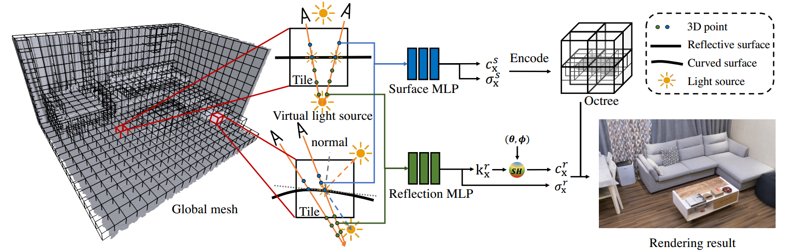

# Scalable-Neural-Indoor-Scene-Rendering



### [Project Page](xxx) | [Video](xxx) | [Paper](xxx) 

We propose a scalable neural scene reconstruction and rendering method to support distributed training and interactive rendering of large indoor scenes.


## Requirements

+ **System**: Ubuntu 16.04 or 18.04
+ **GCC/G++**: 7.5.0 
+ **GPU** : we implement our method on RTX 3090. 
+ **CUDA version**: 11.1 or higher
+ **python**: 3.8 

To install required python packages:

```shell
conda env create -f env.yaml
```

For interactive rendering, you should also install **glfw**.


## Rendering

Our method can render image of resolution 1280 x 720 in 20 FPS. 

For TensorRT acceleration, please first follow the [TensorRT Installation Guide](https://docs.nvidia.com/deeplearning/tensorrt/install-guide/index.html), then install [torch2trt](https://github.com/NVIDIA-AI-IOT/torch2trt#option-1---without-plugins).

### Build for rendering

To build the rendering project:

```shell
cd rendering
bash build.sh
```


### Interactive rendering


We have provided a demo for interactive rendering. 

You can download the necessary rendering data [here](https://drive.google.com/file/d/1Hh0XhHqLO2Tq2vXU-WwKq16Z6K7HZCT1/view?usp=sharing). Unzip file:

```shell
unzip data.zip
```

Then, replace the ` scene path` and `cnn path` in `rendering/config/base.yaml` with `data/renderData.npz` and `data/cnn.pth` , run:

```shell
bash demo.sh
```


