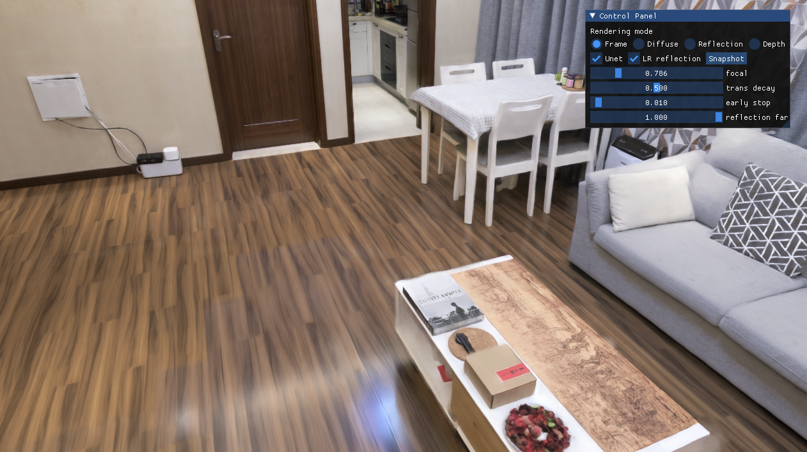

# Scalable-Neural-Indoor-Scene-Rendering


We propose a scalable neural scene reconstruction and rendering method to support distributed training and interactive rendering of large indoor scenes.


## Requirements

+ **System**: Ubuntu 16.04 or 18.04
+ **GCC/G++**: 7.5.0 or higher
+ **GPU** : we implement our method on RTX 3090. 
+ **CUDA version**: 11.1 or higher
+ **python**: 3.8 

To install required python packages:

```shell
pip install -r requirements.txt
```

For interactive rendering, you should also install **glfw**.


## Rendering

Our method can render image of resolution 1280 x 720 in 20 FPS. 

### Build for rendering

To build the rendering project:

```shell
cd rendering
bash build.sh
```


### Interactive rendering



We have provided a demo for interactive rendering. You can download the necessary rendering data [here](www.baidu.com). 

Then, change the ` scene path` and `cnn path` in `rendering/config/base.yaml` and run:

```shell
bash demo.sh
```


## Training

coming soon ...


